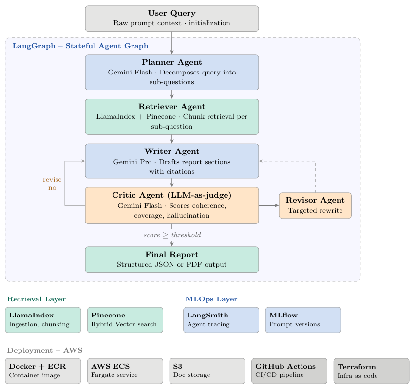

# Aegis

Multi-agent research synthesis system using LangGraph, Gemini, LlamaIndex, and Pinecone with full LLMOps instrumentation.

**Goal:** To Built a production-grade multi-agent pipeline using LangGraph for stateful orchestration; agents autonomously plan, retrieve (LlamaIndex + Pinecone), draft, and self-critique research reports using Gemini. Deploy on AWS (ECS + ECR) with full MLOps instrumentation via LangSmith and MLflow; CI/CD via GitHub Actions + Terraform.

## System Architecture



## Project Structure - Expanded (for initial dev)

```text
aegis/
│
├── .github/
│   └── workflows/
│       └── deploy.yml                  # GitHub Actions - build, push to ECR, deploy to ECS
│
├── infra/
│   ├── main.tf
│   ├── variables.tf
│   ├── outputs.tf
│   └── modules/
│       ├── ecr/
│       │   ├── main.tf
│       │   └── outputs.tf
│       ├── ecs/
│       │   ├── main.tf
│       │   └── outputs.tf
│       ├── s3/
│       │   ├── main.tf
│       │   └── outputs.tf
│       └── iam/
│           ├── main.tf
│           └── outputs.tf
│
├── app/
│   ├── main.py                        # FastAPI entrypoint - registers routers, startup events
│   ├── config.py                      # Pydantic settings - all env vars in one place
│   │
│   ├── schemas/                       # All Pydantic models - request, response, internal contracts
│   │   ├── api.py                     # ResearchRequest, ResearchResponse, IngestRequest
│   │   ├── report.py                  # ReportSection, Citation, FinalReport
│   │   ├── retrieval.py               # RetrievedChunk, QueryResult
│   │   └── evaluation.py              # CriticScore, EvalResult, DimensionScore
│   │
│   ├── api/
│   │   └── routes/
│   │       ├── research.py            # POST /research - thin route, delegates to service
│   │       └── ingest.py              # POST /ingest - thin route, delegates to service
│   │
│   ├── services/                      # Business logic layer - routes call services, services call graph/retrieval
│   │   ├── research_service.py        # Initialises graph, runs it, formats and returns response
│   │   └── ingestion_service.py       # Orchestrates document loading, chunking, embedding, upsert
│   │
│   ├── graph/
│   │   ├── state.py                   # LangGraph TypedDict state - single contract for all nodes
│   │   ├── graph.py                   # Graph assembly - nodes, edges, conditional routing
│   │   └── nodes/
│   │       ├── planner_node.py        # Gemini Flash - decomposes query into sub questions
│   │       ├── retriever_node.py      # LlamaIndex + Pinecone - retrieves chunks per sub question
│   │       ├── report_writer_node.py  # Gemini Pro - synthesises draft report with citations
│   │       ├── report_critic_node.py  # Gemini Flash - LLM-as-judge scoring
│   │       └── report_revisor_node.py # Gemini Flash - targeted rewrite based on critic feedback
│   │
│   ├── retrieval/
│   │   ├── ingestion.py               # LlamaIndex ingestion pipeline - load, chunk, embed, upsert
│   │   ├── query.py                   # LlamaIndex query pipeline - embed, hybrid search, rerank
│   │   └── pinecone_client.py         # Pinecone init and index management
│   │
│   ├── llm/
│   │   ├── gemini.py                  # Gemini Flash + Pro client setup, retry logic
│   │   └── prompts/
│   │       ├── planner_prompt.py
│   │       ├── writer_prompt.py
│   │       ├── critic_prompt.py
│   │       └── revisor_prompt.py
│   │
│   ├── evaluation/
│   │   ├── metrics.py                 # Custom metric definitions - coherence, coverage, hallucination
│   │   ├── judge.py                   # Parses critic LLM output into structured EvalResult
│   │   └── mlflow_logger.py           # Logs prompt version, scores, token counts, latency to MLflow
│   │
│   ├── observability/                 # First-class concern, not a utility
│   │   ├── langsmith.py               # LangSmith callback - attaches to LangGraph for full trace
│   │   └── logging.py                 # Structured logging setup (JSON logs for CloudWatch)
│   │
│   ├── output/
│   │   ├── formatter.py               # Assembles FinalReport schema from graph state
│   │   └── pdf_renderer.py            # WeasyPrint - renders report to PDF
│   │
│   └── utils/
│       └── s3_client.py               # S3 upload/download helpers
│
├── tests/
│   ├── unit/
│   │   ├── test_planner_node.py
│   │   ├── test_report_critic_node.py
│   │   └── test_retriever_node.py
│   └── integration/
│       └── test_graph.py              # Full graph run with mock query
│
├── scripts/
│   ├── ingest_sample_docs.py          # Seeds Pinecone with sample documents for testing
│   └── run_eval_batch.py              # Runs N queries, logs all scores to MLflow
│
├── Dockerfile
├── docker-compose.yml
├── requirements.txt
├── .env.example
├── .gitignore
└── README.md
```
